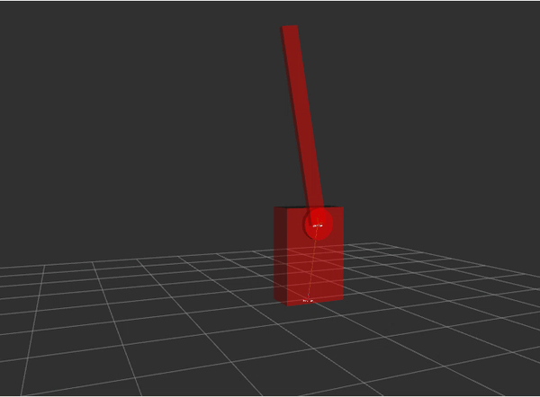

# Modbus Barrier Gate Simulator

This is a basic simulator for a barrier gate which can be run via RVIZ (ROS) to simulate the closing and opening of the gate. The barrier acts as a modbus server and accepts commands as per the following specifications

|Command|Address|Value|Result|
|--|--|--|--|
|5 Force Coil Write | 0 | False | Gate Closed |
|5 Force Coil Write | 0 | True | Gate Opened |

## Quick Setup
Currently the code has been tested to work with ROS Melodic. Please see their website on instructions pertaining to installation on your specific OS.

After ROS melodic is installed and a catkin workspace has been created, clone this repository inside the src folder

    git clone https://github.com/faisalthaheem/ros_melodic_modbus_barrier_simulator

then, launch the barrier simulation using RVIZ with following commands

    cd ros_melodic_modbus_barrier_simulator
    roslaunch ros_melodic_modbus_barrier_simulator display.launch model:=urdf/barrier_robot.urdf

finally, launch the modbus server for the barrier with the following command

    cd src
    python modbus-barrier-server.py

The server is configured to listen on all interfaces ("0.0.0.0") and port 5022

## Debugging
To view the joint states published to ROS, following command can be used

    rostopic echo /joint_states
